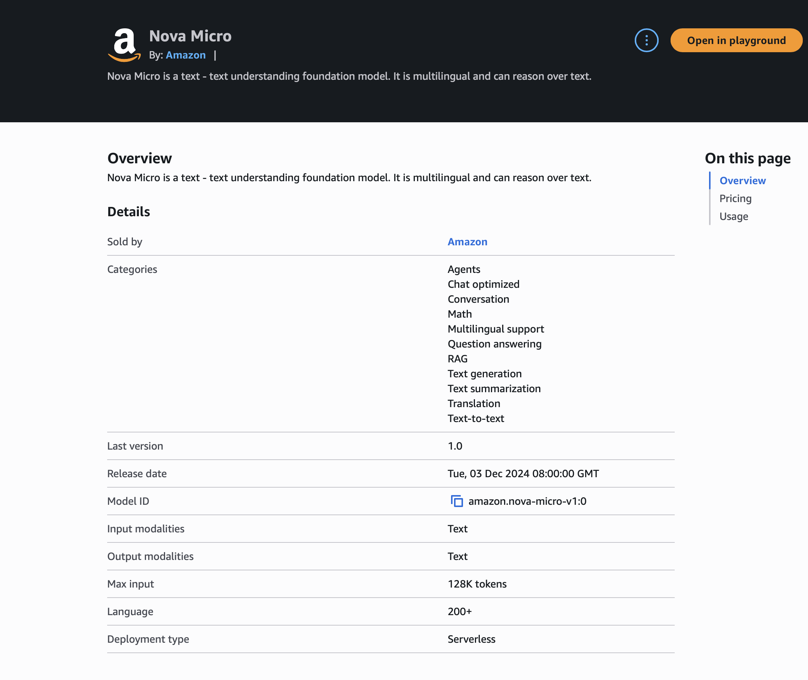

# SirhurryUp Architecture Advisor

A grounded Retrieval-Augmented Generation (RAG) prototype built to answer architecture questions using SirhurryUp's own technical documentation.

## The Business Problem

As technical documentation grows, finding the right information becomes harder. Engineers may know that an answer exists somewhere in the documentation but still have to search across multiple files to find it.

The SirhurryUp Architecture Advisor explores a different approach:

> Ask a question in natural language, retrieve relevant evidence from the company's documentation, and use a foundation model to generate an answer grounded in that evidence.

The goal is not to give the model unrestricted authority to answer architecture questions. The goal is to make company documentation the source of truth.

## What I Built

The prototype combines:

- Markdown documents as the initial knowledge source
- Sentence Transformers for local text embeddings
- Semantic similarity for document retrieval
- Python for retrieval and prompt assembly
- Amazon Bedrock for managed foundation-model access
- Amazon Nova Micro for text generation
- Grounding instructions that tell the model not to answer beyond the supplied documentation

The current request flow is:

Question → Embedding → Semantic Retrieval → Retrieved Evidence → Prompt Augmentation → Amazon Bedrock → Nova Micro → Grounded Answer

## How RAG Works in This Project

The Architecture Advisor uses three stages:

**Retrieval** — Find the SirhurryUp documentation most relevant to the user's question.

**Augmentation** — Combine the retrieved evidence with the user's question and the application's grounding instructions.

**Generation** — Send that assembled context through Amazon Bedrock to Nova Micro, which generates an answer based on the supplied evidence.

In short:

> Retrieve the relevant information → combine it with the rules and question → generate a grounded answer.

RAG does not retrain the foundation model on SirhurryUp documentation. It supplies relevant company knowledge to the model at request time.

## Hidden Gems: What the Happy Path Did Not Show

Building the pipeline exposed several lessons that were easy to miss when looking only at successful examples.

### AWS CLI Configuration Is Local

AWS CLI profiles configured on one computer do not automatically exist on another. Each development machine needs its own local AWS CLI configuration.

Before making AWS calls, verify the active identity:

```bash
aws sts get-caller-identity --profile sirhurryup-sandbox
```

### AWS CLI Authentication Does Not Automatically Mean boto3 Is Ready

The AWS CLI successfully authenticated with `aws login`, but the Python application initially failed when boto3 attempted to use the same login credentials.

The error revealed that the login credential provider required AWS CRT support:

```bash
pip install "botocore[crt]"
```

The important troubleshooting lesson was to identify the failing boundary before changing application code.

### Region Configuration Can Exist at Multiple Layers

The Bedrock Runtime client explicitly used `us-east-1`, but credential refresh still produced a `NoRegionError`.

The Sandbox profile also needed a Region:

```bash
aws configure set region us-east-1 --profile sirhurryup-sandbox
```

A Region configured for an AWS service client does not necessarily satisfy every SDK or authentication operation.

### Successful Retrieval Does Not Mean Good Retrieval

The semantic search code worked correctly but sometimes ranked weak evidence above the information that actually answered the question.

This demonstrated an important distinction:

> Semantic similarity is not the same as relevance or answerability.

Retrieval quality must therefore be evaluated independently from model quality.

### The LLM Is Not Always the Problem

A poor generated answer can begin with poor evidence upstream. Debugging a RAG system means examining the entire path:

Question → Retrieval → Evidence → Prompt → Model → Response

Blaming the model without inspecting retrieval can hide the actual failure.

### Grounding Can Prevent Unsupported Answers

When asked which EC2 instance type SirhurryUp should use for PostgreSQL, the retriever still returned its closest available chunks even though none answered the question.

Nova Micro responded:

> I don't have enough information in the documentation.

That refusal was desirable behavior. The model followed the grounding instructions rather than inventing an unsupported company recommendation.

### Temporary AWS Authentication Must Be Re-established

This project uses temporary AWS authentication rather than long-lived access keys.

After restarting the development environment or when the temporary session is no longer valid, the AWS login may need to be established again before boto3 can successfully invoke Amazon Bedrock:

```bash
aws login --profile sirhurryup-sandbox
```

### A Local Embedding Model Can Still Reach the Network

The Sentence Transformers model was already downloaded and cached locally, but application startup still attempted to contact Hugging Face for model metadata. When that connection timed out, the RAG pipeline appeared to hang before retrieval even began.

The embedding model can be explicitly loaded from the local cache:

```python
model = SentenceTransformer(
    "all-MiniLM-L6-v2",
    local_files_only=True
)
```

This removes an unnecessary network dependency after the model has been downloaded.

The troubleshooting lesson was to trace the execution path before blaming Bedrock. A RAG application can depend on several external boundaries, and a delay upstream may prevent the request from ever reaching the foundation model.

## Architecture

The current prototype separates retrieval from generation so each part of the pipeline can be tested and reasoned about independently.

```text
SirhurryUp Markdown Documentation
              ↓
        Document Chunking
              ↓
   Sentence Transformer Embeddings
              ↓
      Semantic Similarity
              ↓
      Relevance Threshold
              ↓
       Retrieved Evidence
              ↓
 Question + Evidence + Grounding Rules
              ↓
       Amazon Bedrock Runtime
              ↓
         Amazon Nova Micro
              ↓
        Grounded Response
```

The embedding and retrieval process runs locally. Amazon Bedrock provides managed access to the foundation model used for generation.

The current relevance threshold of `0.60` is an experimental prototype value derived from observed test behavior. It should not be treated as a production-ready confidence boundary without a larger evaluation dataset.

## Project Structure

```text
sirhurryup-architecture-advisor/
├── app/
│   ├── embeddings.py
│   ├── retrieval.py
│   └── rag.py
├── docs/
│   ├── aws-account-boundaries.md
│   ├── production-websites.md
│   ├── troubleshooting.md
│   └── screenshots/
│       ├── 01-bedrock-nova-micro-model-details.png
│       ├── 02-bedrock-grounded-rag-response.png
│       ├── 03-boto3-bedrock-nova-successful-invocation.png
│       ├── 04-semantic-search-retrieval-quality-failure.png
│       ├── 05-semantic-search-high-quality-retrieval.png
│       ├── 06-end-to-end-rag-pipeline-success.png
│       ├── 07-grounding-unknown-knowledge-test.png
│       └── 08-relevance-gate-grounded-answer-success.png
├── .gitignore
├── README.md
└── requirements.txt
```

### Application Files

- `embeddings.py` explores how text is converted into numerical embeddings.
- `retrieval.py` loads the local embedding model, chunks the documentation, compares semantic similarity, and returns ranked evidence.
- `rag.py` applies the relevance gate, assembles the grounded prompt, invokes Amazon Nova Micro through Amazon Bedrock Runtime, and displays the response.

### Knowledge Sources

The `docs/` directory contains the SirhurryUp documentation used as the prototype knowledge base. These documents remain the source of truth supplied to the model at request time.

## Setup and Running the Project

### 1. Create and Activate a Python Virtual Environment

```bash
python3 -m venv .venv
source .venv/bin/activate
```

### 2. Install the Python Dependencies

```bash
python -m pip install -r requirements.txt
```

The project uses Sentence Transformers for local embeddings and boto3 to communicate with Amazon Bedrock.

### 3. Configure AWS Authentication

This project uses temporary AWS authentication rather than storing long-lived AWS access keys in the repository.

Authenticate with the AWS profile that has permission to invoke Amazon Bedrock:

```bash
aws login --profile sirhurryup-sandbox
```

Verify the AWS identity before running the application:

```bash
aws sts get-caller-identity --profile sirhurryup-sandbox
```

The profile also needs an AWS Region configured:

```bash
aws configure set region us-east-1 --profile sirhurryup-sandbox
```

Do not commit AWS credentials or local AWS configuration files to the repository.

### 4. Run the RAG Application

From the repository root:

```bash
python app/rag.py
```

The application retrieves relevant evidence from the Markdown knowledge base, applies the relevance threshold, constructs the grounded prompt, and invokes Amazon Nova Micro through Amazon Bedrock Runtime.

### 5. Expected Behavior

For a supported question, the application should retrieve relevant documentation and generate an evidence-grounded answer.

For example:

```text
QUESTION:
What does CloudFront use to access the private S3 bucket?

NOVA RESPONSE:
CloudFront uses Origin Access Control to access the private S3 bucket.
```

For a question whose retrieved evidence does not meet the relevance threshold, the application stops before invoking the foundation model:

```text
INSUFFICIENT RETRIEVAL EVIDENCE
No retrieved documentation met the 0.60 relevance threshold.
```

## Evaluation and Current Limitations

This project is a working prototype designed to demonstrate and evaluate a grounded RAG architecture. It is not yet a production knowledge system.

### What Has Been Validated

The prototype has demonstrated that it can:

- Retrieve semantically relevant chunks from the SirhurryUp documentation.
- Rank retrieved evidence using cosine similarity.
- Reject retrieved evidence that falls below the current `0.60` relevance threshold.
- Send grounded context to Amazon Nova Micro through Amazon Bedrock Runtime.
- Generate concise answers when the documentation directly supports the question.
- Refuse unsupported company-specific recommendations rather than inventing an answer.
- Load the cached Sentence Transformers embedding model locally without requiring a Hugging Face request during normal execution.

### Current Limitations

The knowledge base is intentionally small and consists of local Markdown files.

The `0.60` relevance threshold was selected from a limited set of observed tests. A larger evaluation dataset is required before treating it as a reliable production boundary.

Semantic similarity alone does not guarantee that a retrieved chunk contains the best evidence for answering a question.

The current prototype does not include a vector database, automated document ingestion, reranking, citations in generated answers, user authentication, an API or web interface, monitoring, or production deployment.

These are potential future improvements, not requirements for proving the current architecture.

### Design Priority

For architecture guidance, the prototype favors a false refusal over a confident unsupported recommendation.

When evidence is weak, the safer outcome is:

> I don't have enough information in the documentation.

This is intentional fail-closed behavior.

## Build Evidence

The screenshots in `docs/screenshots/` preserve the development and validation path of the prototype rather than showing only the final successful result.

### 01 — Amazon Nova Micro Model Selection



Documents the Amazon Bedrock model selected for the generation layer.

### 02 — Initial Grounded Response

`02-bedrock-grounded-rag-response.png`

Shows the initial Bedrock Playground test using supplied SirhurryUp context to constrain the model's response.

### 03 — Python to Bedrock Integration

`03-boto3-bedrock-nova-successful-invocation.png`

Confirms that the local Python application can successfully invoke Amazon Nova Micro through Amazon Bedrock Runtime using boto3.

### 04 — Retrieval Quality Failure

`04-semantic-search-retrieval-quality-failure.png`

Captures an important failure: semantic search was operational, but the highest-ranked result was not necessarily the evidence that best answered the question.

### 05 — High-Quality Semantic Retrieval

`05-semantic-search-high-quality-retrieval.png`

Demonstrates a question for which semantic retrieval strongly identifies the relevant documentation.

### 06 — End-to-End RAG Pipeline

`06-end-to-end-rag-pipeline-success.png`

Shows retrieval, prompt augmentation, Bedrock invocation, and grounded generation operating as one pipeline.

### 07 — Unsupported Knowledge Test

`07-grounding-unknown-knowledge-test.png`

Tests the system with a company-specific question that the documentation cannot answer. Nova refuses to invent an unsupported recommendation.

### 08 — Relevance Gate and Grounded Answer

`08-relevance-gate-grounded-answer-success.png`

Shows the improved pipeline after introducing a minimum relevance threshold and refining the grounding instructions. Relevant evidence passes the gate and Nova generates a concise answer supported by the documentation.

## What This Project Demonstrated

The most important result was not simply getting a foundation model to return an answer.

The project demonstrated how retrieval quality, grounding instructions, application logic, AWS authentication, SDK configuration, external dependencies, and model inference work together as separate parts of a RAG system.

The core mental model is:

> Find the relevant information → add it to the question and rules → generate a response based on the evidence.
